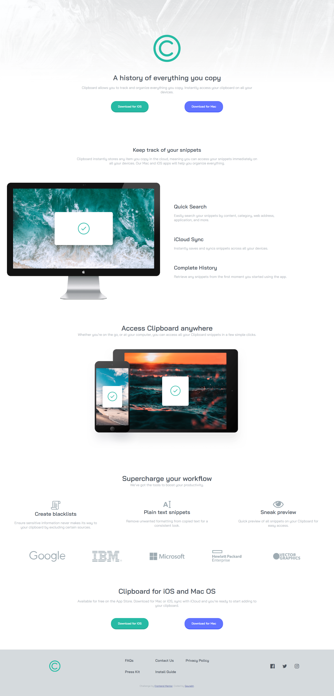
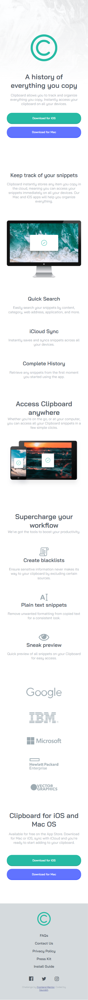

# Frontend Mentor - Clipboard landing page solution

This is a solution to the [Clipboard landing page challenge on Frontend Mentor](https://www.frontendmentor.io/challenges/clipboard-landing-page-5cc9bccd6c4c91111378ecb9). Frontend Mentor challenges help you improve your coding skills by building realistic projects. 

## Table of contents

- [Overview](#overview)
  - [The challenge](#the-challenge)
  - [Screenshot](#screenshot)
  - [Links](#links)
- [My process](#my-process)
  - [Built with](#built-with)
  - [What I learned](#what-i-learned)
  - [Continued development](#continued-development)
  - [Useful resources](#useful-resources)
- [Author](#author)
- [Acknowledgments](#acknowledgments)

## Overview

### The challenge

Users should be able to:

- View the optimal layout for the site depending on their device's screen size
- See hover states for all interactive elements on the page
- Animation on scroll added.

### Screenshot

#### Desktop

#### Mobile

### Links

- Solution URL: [Add solution URL here](https://your-solution-url.com)
- Live Site URL: [Add live site URL here](https://your-live-site-url.com)

## My process

### Built with

- Semantic HTML5 markup
- CSS custom properties
- Mobile-first workflow
- SASS
- Flexbox
- CSS Grid

### What I learned

I've implemented animate on scroll functionality inorder make the pages even interactive in nature and catches user attention quickly.Also focused on both flexbox and grid.

### Continued development

Really looking forward in working with much more complex CSS styles. I will be working on understanding flexbox and grid concepts in detail so that it'd be easier for me as I move along.

### Useful resources

- [W3 Schools](https://www.w3schools.com/) - This has been my first line of contact when I was stuck at stages. It usually solved all my quests.

## Author

- Frontend Mentor - [@saurabh1996-rex](https://www.frontendmentor.io/profile/saurabh1996-rex)

## Acknowledgments

Always thankful to Frontendmentor.io as they've provided all the necessary files so that it was easier to work with the project. Also special metion to the one who have designed this project, Great Work! 